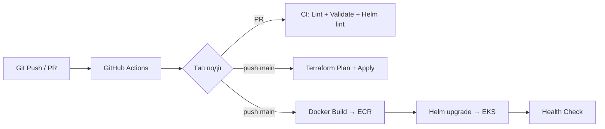

# 🚀 AWS Infrastructure для Python/Flask застосунку

## 📋 Зміст
1. [Огляд проекту](#огляд-проекту)
2. [Архітектура](#архітектура)
3. [Передумови](#передумови)
4. [Швидкий старт](#швидкий-старт)
5. [Детальна конфігурація](#детальна-конфігурація)
6. [CI/CD Pipeline](#cicd-pipeline)
7. [Моніторинг та управління](#моніторинг-та-управління)
8. [Troubleshooting](#troubleshooting)
9. [Безпека](#безпека)
10. [Видалення інфраструктури](#видалення-інфраструктури)

---

## Огляд проекту

Повністю автоматизована інфраструктура AWS для розгортання **Python Flask застосунку** (Title Checker WebApp) з використанням:
- **Infrastructure as Code**: Terraform
- **Containerization**: Docker + ECR
- **CI/CD**: GitHub Actions (OIDC, без довгострокових ключів)
- **Orchestration**: AWS EKS + Helm
- **Auto Scaling**: HorizontalPodAutoscaler (HPA)
- **Load Balancing**: Application Load Balancer (AWS LB Controller)
- **Database**: RDS MySQL
- **Remote Management**: AWS Systems Manager (SSM)

### 🎯 Ключові особливості
- ✅ Без SSH доступу (повністю через SSM)
- ✅ Автоматичне масштабування EC2 інстансів
- ✅ Blue-Green deployments через GitLab CI
- ✅ Health checks та auto-healing
- ✅ Ізольована мережева архітектура (VPC, приватні підмережі)
- ✅ Централізоване логування у CloudWatch

---

## Архітектура

```
┌──────────────────────────────────────────────────────────────┐
│                        Internet                              │
└────────────────────────┬─────────────────────────────────────┘
                         │
                         ▼
              ┌──────────────────────┐
              │  Application Load    │
              │    Balancer (ALB)    │
              │  Ports: 80, 8501     │
              └──────────┬───────────┘
                         │
         ┌───────────────┴───────────────┐
         ▼                               ▼
┌─────────────────┐           ┌─────────────────┐
│  EC2 Instance   │           │  EC2 Instance   │
│  (Private AZ1)  │           │  (Private AZ2)  │
│  Auto Scaling   │           │  Auto Scaling   │
│  Docker + Flask │           │  Docker + Flask │
└────────┬────────┘           └────────┬────────┘
         │                              │
         └───────────────┬──────────────┘
                         ▼
              ┌──────────────────────┐
              │    RDS MySQL         │
              │  (Private Subnet)    │
              │  Multi-AZ            │
              └──────────────────────┘

┌──────────────────────────────────────────────────────────────┐
│                    Supporting Services                       │
├──────────────────────────────────────────────────────────────┤
│  • ECR: Docker Registry                                      │
│  • S3: Terraform State, Artifacts                           │
│  • SSM: Remote Management                                    │
│  • IAM: OIDC GitLab + EC2 Roles                             │
│  • CloudWatch: Logs & Metrics                               │
└──────────────────────────────────────────────────────────────┘
```

### Компоненти інфраструктури

| Компонент | Призначення | Файл |
|-----------|-------------|------|
| **VPC** | Ізольована мережа з 2 публічними та 2 приватними підмережами | `vpc.tf` |
| **ALB** | Балансування навантаження, Health Checks | `alb.tf` |
| **ASG** | Автоматичне масштабування EC2 (1-3 інстанси) | `asg_be.tf` |
| **ECR** | Docker registry для образів застосунку | `ecr.tf` |
| **RDS** | MySQL база даних (Multi-AZ) | `rds.tf` |
| **SSM** | Деплой контейнерів без SSH | `ssm.tf` |
| **IAM** | Ролі для EC2, GitLab OIDC | `iam.tf` |
| **Security Groups** | Firewall правила | `sg.tf` |

---

## Передумови

### 1. Встановлені інструменти
```bash
# Terraform
terraform --version  # >= 1.5.0

# AWS CLI
aws --version  # >= 2.0

# Docker (для локальної розробки)
docker --version

# Git
git --version
```

### 2. AWS Credentials
```bash
# Налаштуйте AWS CLI
aws configure

# Або використовуйте профіль
export AWS_PROFILE=Terraform_1
```

### 3. GitLab Setup (для CI/CD)
- GitLab Runner з Docker executor
- AWS OIDC налаштований (див. `setup/oidc.tf`)
- Variables у GitLab CI/CD Settings:
  - `AWS_REGION`: `us-east-1`
  - `ECR_REPOSITORY`: `<account_id>.dkr.ecr.us-east-1.amazonaws.com/backend-app`

---

## Швидкий старт

### 1️⃣ Клонуйте репозиторій
```bash
git clone <repository-url>
cd newinfra
```

### 2️⃣ Налаштуйте змінні
```bash
cd infra
cp terraform.tfvars.example terraform.tfvars  # якщо існує
nano terraform.tfvars
```

**Мінімальна конфігурація** (`terraform.tfvars`):
```hcl
aws_region    = "us-east-1"
instance_type = "t2.micro"
environment   = "dev"
db_password   = "YourSecurePassword123!"  # Змініть це!
```

### 3️⃣ Ініціалізуйте Terraform
```bash
terraform init
```

### 4️⃣ Розгорніть інфраструктуру
```bash
# Перегляньте план
terraform plan

# Застосуйте зміни
terraform apply -auto-approve
```

### 5️⃣ Отримайте URL застосунку
```bash
terraform output load_balancer_url
# Вихід: http://alb-xxxxx.us-east-1.elb.amazonaws.com
```

### 6️⃣ Деплой Docker образу

**Варіант A: Через GitLab CI/CD** (рекомендовано)
```bash
git add .
git commit -m "Initial commit"
git push origin main
# Pipeline автоматично збере та задеплоїть застосунок
```

**Варіант B: Вручну**
```bash
# 1. Збудуйте образ
cd infra/app
docker build -t backend-app:latest .

# 2. Залогіньтесь у ECR
aws ecr get-login-password --region us-east-1 | \
  docker login --username AWS --password-stdin <account_id>.dkr.ecr.us-east-1.amazonaws.com

# 3. Тегуйте та push
docker tag backend-app:latest <account_id>.dkr.ecr.us-east-1.amazonaws.com/backend-app:latest
docker push <account_id>.dkr.ecr.us-east-1.amazonaws.com/backend-app:latest

# 4. Запустіть SSM деплой
aws ssm send-command \
  --document-name "DeployBackendFromECR" \
  --targets "Key=tag:Environment,Values=dev" \
  --parameters '{"imagetag":"latest"}' \
  --region us-east-1
```

### 7️⃣ Перевірте роботу
```bash
# Health check
curl http://<alb-dns>/health

# Головна сторінка
curl http://<alb-dns>/
```

---

## Детальна конфігурація

### Змінні Terraform

| Змінна | Опис | Значення за замовчуванням |
|--------|------|---------------------------|
| `aws_region` | AWS регіон | `us-east-1` |
| `instance_type` | Тип EC2 інстансу | `t2.micro` |
| `key_pair_name` | Ім'я SSH ключа (опціонально) | `""` |
| `db_name` | Ім'я RDS бази | `appdb` |
| `db_username` | RDS користувач | `admin` |
| `db_password` | RDS пароль (чутливо!) | `ChangeMe123!` |
| `environment` | Назва середовища | `dev` |

### Security Groups

**ALB Security Group** (публічний):
- Ingress: 80 (HTTP), 8501 (Flask)
- Egress: всі

**EC2 Security Group** (приватний):
- Ingress: 8501 від ALB
- Egress: всі

**RDS Security Group** (приватний):
- Ingress: 3306 від EC2
- Egress: немає

### Auto Scaling

```hcl
min_size         = 1
max_size         = 3
desired_capacity = 2

# Health Check
health_check_type         = "ELB"
health_check_grace_period = 300

# Target Tracking Policy
target_value = 50.0  # CPU 50%
```

---

## CI/CD Pipeline

> Pipeline повністю переведено на **GitHub Actions** з OIDC-аутентифікацією (без довгострокових AWS ключів).

### Архітектура Pipeline



### Workflows (.github/workflows/)

| Файл | Тригер | Що робить |
|------|--------|-----------|
| `ci.yml` | PR / push main | Terraform fmt/validate, Docker build, Python lint, Helm lint |
| `terraform.yml` | push `infra/**` | Plan (з коментарем у PR) → Apply (manual approval) |
| `cd.yml` | push `infra/app/**` або `helm/**` | Build & push ECR → Helm upgrade EKS |

### 🔐 Необхідні GitHub Secrets

Додай у **Settings → Secrets and variables → Actions**:

| Secret | Опис |
|--------|------|
| `AWS_ROLE_ARN` | ARN IAM ролі для GitHub OIDC, напр. `arn:aws:iam::412381736597:role/github-actions-role` |
| `TF_STATE_BUCKET` | S3 бакет для Terraform state, напр. `bucket123ultra` |
| `TF_LOCK_TABLE` | DynamoDB таблиця для state locking, напр. `terraform-lock-table` |
| `DB_PASSWORD` | Пароль до RDS |

### 🏗 Налаштування OIDC (одноразово)

```bash
# 1. Додати GitHub як OIDC Provider у AWS IAM
# (вже є у setup/oidc.tf — запусти його)
cd setup
terraform init && terraform apply

# 2. Створити IAM роль з довірою до GitHub
# Trust Policy (приклад — адаптуй під свій repo):
```

```json
{
  "Version": "2012-10-17",
  "Statement": [{
    "Effect": "Allow",
    "Principal": { "Federated": "arn:aws:iam::412381736597:oidc-provider/token.actions.githubusercontent.com" },
    "Action": "sts:AssumeRoleWithWebIdentity",
    "Condition": {
      "StringLike": {
        "token.actions.githubusercontent.com:sub": "repo:v-semeniy/infragit:*"
      }
    }
  }]
}
```

### Приклад використання

```bash
# 1. Зміни в застосунку → автоматичний CI/CD деплой
vim infra/app/title_checker.py
git add . && git commit -m "feat: нова функція" && git push origin main

# Pipeline автоматично:
#   CI:  перевірить Terraform fmt, Docker build, Helm lint
#   CD:  збудує новий образ → push ECR → helm upgrade → EKS rolling update

# 2. Зміни в інфраструктурі → Terraform workflow
vim infra/eks.tf
git add . && git commit -m "infra: оновлення EKS node group" && git push origin main

# Terraform Plan покаже diff у PR-коментарі
# Apply відбудеться після manual approval (GitHub Environment: production)
```

---

## Моніторинг та управління

### 1. AWS Console доступ

**Systems Manager → Session Manager**
```bash
# Підключення до EC2 без SSH
1. AWS Console → Systems Manager → Session Manager
2. Вибрати інстанс
3. Start Session
```

**CloudWatch Logs**
```bash
# User Data logs
/var/log/user-data.log

# Docker logs
/var/log/docker.log
```

### 2. Перевірка здоров'я

```bash
# Target Group health
aws elbv2 describe-target-health \
  --target-group-arn <tg-arn> \
  --region us-east-1

# Статус ASG
aws autoscaling describe-auto-scaling-groups \
  --auto-scaling-group-names backend-asg \
  --region us-east-1
```

### 3. Логи застосунку

```bash
# SSM Session
docker logs <container_id>

# CloudWatch Logs (якщо налаштовано)
aws logs tail /aws/ec2/backend-app --follow
```

---

## Troubleshooting

### ❌ Проблема: ALB повертає 502 Bad Gateway

**Причини:**
1. Контейнер не запущений на EC2
2. Health check падає
3. Security Group блокує трафік

**Рішення:**
```bash
# 1. Перевірте Target Group
aws elbv2 describe-target-health --target-group-arn <arn>

# 2. SSM Session на EC2
docker ps  # Переконайтесь що контейнер запущений
docker logs <container>

# 3. Перевірте health endpoint
curl localhost:8501/health

# 4. Перезапустіть контейнер
docker restart <container>
```

### ❌ Проблема: Docker image not found

**Рішення:**
```bash
# 1. Перевірте ECR
aws ecr describe-images --repository-name backend-app

# 2. Якщо немає 'latest' тега
aws ecr batch-get-image \
  --repository-name backend-app \
  --image-ids imageTag=<sha> \
  --query 'images[].imageManifest' \
  --output text | \
aws ecr put-image \
  --repository-name backend-app \
  --image-tag latest \
  --image-manifest file:///dev/stdin
```

### ❌ Проблема: Terraform state lock

**Рішення:**
```bash
# 1. Перевірте DynamoDB
aws dynamodb scan --table-name terraform-state-lock

# 2. Видаліть lock (ОБЕРЕЖНО!)
aws dynamodb delete-item \
  --table-name terraform-state-lock \
  --key '{"LockID": {"S": "newinfra/terraform.tfstate-md5"}}'
```

### ❌ Проблема: EC2 не реєструється у SSM

**Рішення:**
```bash
# 1. Перевірте IAM роль
aws iam get-instance-profile --instance-profile-name ec2-ssm-role

# 2. Перевірте SSM agent
# (через Session Manager або user-data logs)
systemctl status amazon-ssm-agent

# 3. Перезапустіть agent
sudo systemctl restart amazon-ssm-agent
```

---

## Безпека

### 🔒 Best Practices

1. **Не використовуйте SSH**
   - Всі EC2 у приватних підмережах
   - Доступ тільки через SSM

2. **Секрети**
   - Використовуйте AWS Secrets Manager для `db_password`
   - Не комітьте `terraform.tfvars` з чутливими даними

3. **IAM ролі**
   - Least privilege principle
   - OIDC для GitLab (без static credentials)

4. **Network**
   - RDS тільки в приватних підмережах
   - Security Groups з мінімальними правилами

5. **Encryption**
   - S3 bucket encryption увімкнено
   - RDS encryption at rest

### 🔐 Рекомендовані покращення

```hcl
# Використання Secrets Manager
data "aws_secretsmanager_secret_version" "db_password" {
  secret_id = "prod/db/password"
}

resource "aws_db_instance" "main" {
  password = data.aws_secretsmanager_secret_version.db_password.secret_string
}
```

---

## Видалення інфраструктури

### ⚠️ УВАГА: Це видалить всі ресурси!

```bash
# 1. Видаліть Docker образи з ECR (якщо force_delete = false)
aws ecr batch-delete-image \
  --repository-name backend-app \
  --image-ids "$(aws ecr list-images --repository-name backend-app --query 'imageIds[*]' --output json)"

# 2. Terraform destroy
cd infra
terraform destroy -auto-approve

# 3. Очистіть S3 bucket (якщо потрібно)
aws s3 rb s3://terraform-state-<account-id> --force

# 4. Видаліть DynamoDB lock table
aws dynamodb delete-table --table-name terraform-state-lock
```

---

## 📚 Додаткові ресурси

- [Детальний гайд по інфраструктурі](INFRASTRUCTURE_GUIDE.md)
- [Terraform Docs](https://registry.terraform.io/providers/hashicorp/aws/latest/docs)
- [AWS SSM Documentation](https://docs.aws.amazon.com/systems-manager/)
- [GitLab CI/CD](https://docs.gitlab.com/ee/ci/)

---

## 📞 Підтримка

При виникненні проблем:
1. Перевірте [Troubleshooting](#troubleshooting)
2. Перегляньте CloudWatch Logs
3. Використайте `terraform plan` для перевірки конфігурації

---

## 📄 Ліцензія

MIT License - використовуйте вільно

---

**Створено з ❤️ для автоматизації інфраструктури AWS**

```bash
terraform destroy
```

## Команди для Docker

```bash
docker pull testsemeniy.dkr.ecr.us-east-1.amazonaws.com/title_checker:$${image_tag}
docker run -d --name title_checker -p 8501:8501 testsemeniy.dkr.ecr.us-east-1.amazonaws.com/title_checker:$${image_tag}
```